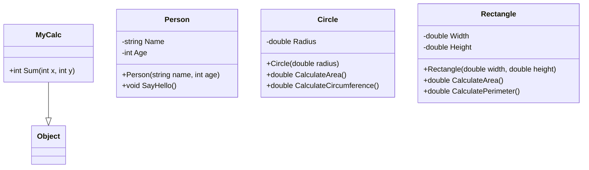

```mermaid
classDiagram
    class MyCalc {
        +int Sum(int x, int y)
    }
    class Person {
        -string Name
        -int Age
        +Person(string name, int age)
        +void SayHello()
    }
    class Circle {
        -double Radius
        +Circle(double radius)
        +double CalculateArea()
        +double CalculateCircumference()
    }
    class Rectangle {
        -double Width
        -double Height
        +Rectangle(double width, double height)
        +double CalculateArea()
        +double CalculatePerimeter()
    }
    MyCalc --|> Object
```
    Person --|> Object
    Circle --|> Object
    Rectangle --|> Object
    Person --* MyCalc : "Uses"
    Circle --* MyCalc : "Uses"
    Rectangle --* MyCalc : "Uses"
